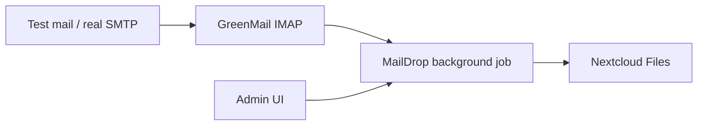

# Nextcloud MailDrop

Nextcloud app **MailDrop**: fetches email via **IMAP**, extracts attachments, and stores them in a configurable folder. Configuration is done in the admin UI.

## Features

- Multiple mapping configurations (IMAP → target folder), each independently enableable
- IMAP fetch (optional SSL/TLS)
- Attachments land flat in the target folder by default (timestamp-prefixed filename); optional per-mail subfolders and/or saving the `.eml`
- Subject and sender filters
- Configurable TLS certificate validation and attachment size limit
- IMAP cursor (`last_uid` / UIDVALIDITY) with reset in the UI
- Mark messages as seen or delete after import
- Connection test and manual fetch per mapping or for all (`occ maildrop:fetch -m <id>`)
- Background job every 5 minutes

## Installation (other Nextcloud instance)

Requirements: Nextcloud **28–34**, PHP **8.1–8.4**, working system cron, outbound IMAP access.

### From a GitHub release

1. Download the release archive: [Releases](https://github.com/djschilling/Nextcloud-MailDrop/releases) → `maildrop-x.y.z.tar.gz`
2. Extract into `custom_apps/` on the server (folder must be named `maildrop`):

```bash
sudo tar -xzf maildrop-1.1.1.tar.gz -C /path/to/nextcloud/custom_apps/
sudo chown -R www-data:www-data /path/to/nextcloud/custom_apps/maildrop
```

3. Enable the app:

```bash
sudo -u www-data php /path/to/nextcloud/occ app:enable maildrop
```

4. In Nextcloud: **Settings → Administration → MailDrop**.

### Build a release yourself

```bash
./scripts/build-release.sh          # version from apps/maildrop/appinfo/info.xml
# or:
./scripts/build-release.sh 1.1.1    # set version in info.xml and build
```

Output: `dist/maildrop-<version>.tar.gz` (includes `vendor/`) and optional `.sha256`.

## Local setup (Docker)

### Requirements

- Docker + Docker Compose
- Python 3 (only for the test-mail script)

### Start

```bash
cd apps/maildrop && composer install --no-dev
cd ../..
docker compose up -d              # core stack (db, mail, nextcloud)
# optional with cron + app init:
docker compose --profile full up -d
```

Wait until Nextcloud is ready (first start can take 1–2 minutes):

```bash
docker compose ps
# enable the app manually (without profile full):
docker compose exec -u www-data nextcloud php occ app:enable maildrop
```

Then:

| Service | URL / port | Credentials |
|---------|------------|-------------|
| Nextcloud | http://localhost:8080 | `admin` / `admin` |
| GreenMail SMTP | localhost:3025 | – |
| GreenMail IMAP | localhost:3143 | `maildrop` / `maildrop` |
| GreenMail Web | http://localhost:8081 | – |

With `docker compose --profile full up -d`, cron and `app-init` (auto-enable) also start.

### Configure the app

1. Log in to Nextcloud: http://localhost:8080
2. **Settings → Administration → MailDrop**
3. Values for the local setup (sensible defaults):

   - Host: `mail`
   - Port: `3143`
   - Encryption: `None`
   - User / password: `maildrop` / `maildrop`
   - Target user: `admin`
   - Target folder: `/Mail-Anhänge`
   - Enable fetch: on

4. **Test connection**, then **Save**

### Send a test email

```bash
python3 scripts/send-test-mail.py
# or with a custom file:
python3 scripts/send-test-mail.py --file ./README.md
```

Then click **Fetch now** in the admin UI (or wait ~5 minutes for the cron job). Attachments appear under **Files → Mail-Anhänge**.

## Integration test (E2E)

The test sends a real email to GreenMail, runs MailDrop fetch, and checks via WebDAV that the attachment is in Nextcloud.

```bash
# Dependencies + stack (if not already running)
cd apps/maildrop && composer install --no-dev && cd ../..
docker compose up -d

# Test
./tests/integration/run.sh
# or:
python3 tests/integration/test_mail_to_nextcloud.py
```

The same test runs in GitHub Actions via `.github/workflows/integration.yml`.

## Project structure

```
apps/maildrop/              # Nextcloud MailDrop app
docker/nextcloud/           # Init script
docker-compose.yml          # Nextcloud, MariaDB, Cron, GreenMail
scripts/send-test-mail.py
scripts/build-release.sh    # Release tarball including vendor/
dist/                       # Build output (gitignored)
```

## Architecture (short)



## License

MIT © David Schilling (`davejs92@gmail.com`) — see [LICENSE](LICENSE).

## Production notes

- IMAP credentials are stored encrypted via Nextcloud’s crypto API.
- Use SSL/TLS and strong passwords for real mailboxes.
- Set target folder and user deliberately; optional subject/sender filters.

## Stop / reset

```bash
docker compose down
# including all data:
docker compose down -v
```
