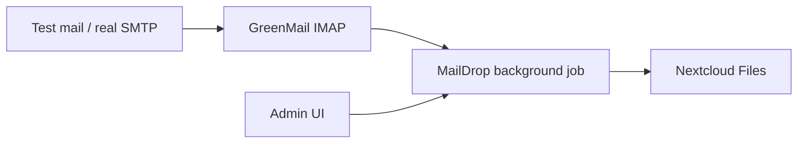

# Nextcloud MailDrop

Nextcloud app **MailDrop**: fetches email via **IMAP**, extracts attachments, and stores them in a configurable folder. Configuration is done in the admin UI.

**Author:** David Schilling (`davejs92@gmail.com`)  
**License:** MIT — see [LICENSE](LICENSE)  
**Latest release:** [GitHub Releases](https://github.com/djschilling/Nextcloud-MailDrop/releases)

## Features

- Multiple mapping configurations (IMAP → target folder), each independently enableable
- IMAP fetch (optional SSL/TLS), with certificate validation toggle
- Attachments land **flat** in the target folder by default (`{Ymd_His}_uid{N}_{filename}`)
- Optional: per-mail subfolder (`create_mail_folder`) and/or save `.eml` next to attachments (`save_mail_file`)
- Subject and sender filters; max attachment size limit
- IMAP cursor (`last_uid` / UIDVALIDITY) with reset in the UI
- Mark messages as seen or delete after import
- Connection test and manual fetch per mapping or for all (`occ maildrop:fetch -m <id>`)
- Background job every 5 minutes
- Admin UI in **English** and **German** (follows the Nextcloud user language)

## Requirements

- Nextcloud **28–36**
- PHP **≥ 8.1** (no PHP `max-version` in `info.xml`; use a PHP version supported by your Nextcloud)
- Working system cron (for the background job)
- Outbound IMAP access to the mail server

## Installation (other Nextcloud instance)

### From a GitHub release

1. Download the release archive: [Releases](https://github.com/djschilling/Nextcloud-MailDrop/releases) → `maildrop-x.y.z.tar.gz`
2. Extract into `custom_apps/` on the server (folder must be named `maildrop`):

```bash
sudo tar -xzf maildrop-1.1.1.tar.gz -C /path/to/nextcloud/custom_apps/
sudo chown -R www-data:www-data /path/to/nextcloud/custom_apps/maildrop
```

3. Enable the app:

```bash
sudo -u www-data php /path/to/nextcloud/occ app:enable maildrop
# Docker example (service name may be `app` or `nextcloud`):
docker compose exec -u www-data app php occ app:enable maildrop
```

4. In Nextcloud: **Settings → Administration → MailDrop**.

### Build a release yourself

```bash
./scripts/build-release.sh          # version from apps/maildrop/appinfo/info.xml
# or:
./scripts/build-release.sh 1.1.1    # set version in info.xml and build
```

Output: `dist/maildrop-<version>.tar.gz` (includes `vendor/`) and optional `.sha256`.

## Configuration (admin UI)

Each **mapping** connects one IMAP mailbox to one Nextcloud target:

| Setting | Notes |
|---------|--------|
| IMAP host / port / encryption | `none`, `tls` (STARTTLS), or `ssl` |
| Verify TLS certificate | Recommended on; turn off only for lab/self-signed |
| IMAP user / password / folder | Password stored encrypted; leave empty on save to keep |
| Target user / folder | Files land in that user’s Nextcloud storage |
| Subject / sender filter | Optional substring match |
| Max attachment size | Bytes; `0` = unlimited (default 25 MiB) |
| Create subfolder per email | Off by default |
| Save `.eml` next to attachments | Off by default |
| Mark as seen / delete after import | Optional |
| Enable fetch | Per-mapping switch (`fetch_enabled`) |
| Reset cursor | Clears `last_uid` / UIDVALIDITY so mail is re-scanned |

## Local setup (Docker)

### Requirements

- Docker + Docker Compose
- Python 3 (test-mail script and E2E)
- Composer (for `apps/maildrop` dependencies)

### Start

```bash
cd apps/maildrop && composer install --no-dev
cd ../..
docker compose up -d              # core stack (db, mail, nextcloud)
# optional with cron + app init:
docker compose --profile full up -d
```

Wait until Nextcloud is ready (first start can take 1–2 minutes):

```bash
docker compose ps
# enable the app manually (without profile full):
docker compose exec -u www-data nextcloud php occ app:enable maildrop
```

| Service | URL / port | Credentials |
|---------|------------|-------------|
| Nextcloud | http://localhost:8080 | `admin` / `admin` |
| GreenMail SMTP | localhost:3025 | – |
| GreenMail IMAP | localhost:3143 | `maildrop` / `maildrop` |
| GreenMail Web | http://localhost:8081 | – |

### Configure for local GreenMail

1. Log in: http://localhost:8080
2. **Settings → Administration → MailDrop**
3. Suggested values: host `mail`, port `3143`, encryption `None`, user/password `maildrop` / `maildrop`, target user `admin`, target folder `/Mail-Anhänge`, enable fetch
4. **Test connection**, then **Save**

### Send a test email

```bash
python3 scripts/send-test-mail.py
# or with a custom file:
python3 scripts/send-test-mail.py --file ./README.md
```

Then **Fetch this mapping** in the admin UI (or wait ~5 minutes). Attachments appear under **Files → Mail-Anhänge** (timestamp-prefixed names unless subfolders are enabled).

## Tests

### Unit

```bash
php apps/maildrop/tests/Unit/AttachmentNamerTest.php
```

### Integration (E2E)

Sends real SMTP mail → GreenMail → `occ maildrop:fetch` → WebDAV checks. Covers four storage modes: flat default, per-mail folder, `.eml` sidecar, and both options together.

```bash
cd apps/maildrop && composer install --no-dev && cd ../..
docker compose up -d
./tests/integration/run.sh
# or:
python3 tests/integration/test_mail_to_nextcloud.py
```

CI: `.github/workflows/integration.yml` (uses `docker-compose.ci.yml` so the app is copied into the container instead of bind-mounted).

## Project structure

```
apps/maildrop/              # Nextcloud MailDrop app
  appinfo/                  # info.xml, routes
  lib/                      # PHP services, settings, occ, job
  js/ css/ templates/       # Admin UI
  l10n/                     # en + de translations
  tests/Unit/               # Unit tests
  CHANGELOG.md
  LICENSE
docker/nextcloud/           # Init script
docker-compose.yml          # Nextcloud, MariaDB, Cron, GreenMail
docker-compose.ci.yml       # CI override (no apps bind-mount)
scripts/send-test-mail.py
scripts/build-release.sh    # Release tarball including vendor/
tests/integration/          # E2E
dist/                       # Build output (gitignored)
```

## Architecture (short)



## Localization

- Source language for UI/API strings: **English**
- Bundles: `apps/maildrop/l10n/en.*` and `apps/maildrop/l10n/de.*`
- UI language follows the logged-in Nextcloud user’s language

## Production notes

- IMAP credentials are stored encrypted via Nextcloud’s crypto API.
- Prefer SSL/TLS and strong passwords for real mailboxes.
- After installing or upgrading, use **Reset cursor** if a previous failed fetch left the cursor stuck.
- Set target folder and user deliberately; use subject/sender filters when one mailbox feeds multiple workflows.

## Troubleshooting

| Symptom | Likely cause |
|---------|----------------|
| `0 imported, 0 skipped`, cursor stays at UID 0 | UID search failed (fixed in 1.1.1 via `getByUidGreater`); upgrade and reset cursor |
| Fetch OK but no files | Wrong IMAP folder (e.g. Sent vs INBOX), filters, or attachment not detected |
| Files in unexpected place | Check **target user** and **target folder**; file picker shows the logged-in admin’s files |
| IMAP login fails after save | Password re-encrypted incorrectly; set the password again and save |

## Stop / reset

```bash
docker compose down
# including all data:
docker compose down -v
```

## License

MIT © David Schilling (`davejs92@gmail.com`) — see [LICENSE](LICENSE).
