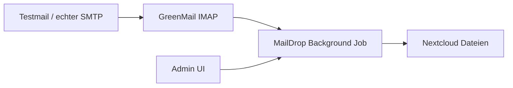

# Nextcloud MailDrop

Nextcloud-App **MailDrop**: holt E-Mails per **IMAP** ab, extrahiert Anhänge und speichert sie in einem konfigurierbaren Ordner. Konfiguration über die Admin-UI.

## Features

- Mehrere Mapping-Konfigurationen (IMAP → Zielordner), jeweils einzeln aktivierbar
- IMAP-Abruf (inkl. optional SSL/TLS)
- Anhänge landen unter einem wählbaren Benutzer/Pfad
- Filter nach Betreff und Absender
- Nachrichten als gelesen markieren oder nach Import löschen
- Verbindungstest und manueller Abruf pro Mapping oder für alle
- Hintergrund-Job alle 5 Minuten

## Installation (andere Nextcloud-Instanz)

Voraussetzungen: Nextcloud **28–31**, PHP **8.1–8.4**, funktionierender System-Cron, ausgehender IMAP-Zugriff.

### Aus GitHub-Release

1. Release-Archiv laden: [Releases](https://github.com/djschilling/Nextcloud-MailDrop/releases) → `maildrop-x.y.z.tar.gz`
2. Auf dem Server nach `custom_apps/` entpacken (Ordner muss `maildrop` heißen):

```bash
sudo tar -xzf maildrop-1.0.0.tar.gz -C /path/to/nextcloud/custom_apps/
sudo chown -R www-data:www-data /path/to/nextcloud/custom_apps/maildrop
```

3. App aktivieren:

```bash
sudo -u www-data php /path/to/nextcloud/occ app:enable maildrop
```

4. In Nextcloud: **Einstellungen → Administration → MailDrop** konfigurieren.

### Release selbst bauen

```bash
./scripts/build-release.sh          # Version aus apps/maildrop/appinfo/info.xml
# oder:
./scripts/build-release.sh 1.0.0    # setzt Version in info.xml und baut
```

Ergebnis: `dist/maildrop-<version>.tar.gz` (inkl. `vendor/`) und optional `.sha256`.

## Lokales Setup (Docker)

### Voraussetzungen

- Docker + Docker Compose
- Python 3 (nur für das Testmail-Skript)

### Starten

```bash
cd apps/maildrop && composer install --no-dev
cd ../..
docker compose up -d              # Kern-Stack (db, mail, nextcloud)
# optional mit Cron + App-Init:
docker compose --profile full up -d
```

Warte, bis Nextcloud bereit ist (erster Start kann 1–2 Minuten dauern):

```bash
docker compose ps
# App manuell enablen (ohne Profile full):
docker compose exec -u www-data nextcloud php occ app:enable maildrop
```

Danach:

| Dienst | URL / Port | Zugangsdaten |
|--------|------------|--------------|
| Nextcloud | http://localhost:8080 | `admin` / `admin` |
| GreenMail SMTP | localhost:3025 | – |
| GreenMail IMAP | localhost:3143 | `maildrop` / `maildrop` |
| GreenMail Web | http://localhost:8081 | – |

Mit `docker compose --profile full up -d` starten zusätzlich Cron und `app-init` (Auto-Enable).

### App konfigurieren

1. In Nextcloud einloggen: http://localhost:8080
2. **Einstellungen → Administration → MailDrop**
3. Werte für das lokale Setup (bereits sinnvoll vorausgefüllt):

   - Host: `mail`
   - Port: `3143`
   - Verschlüsselung: `Keine`
   - Benutzer / Passwort: `maildrop` / `maildrop`
   - Zielbenutzer: `admin`
   - Zielordner: `/Mail-Anhänge`
   - Abruf aktivieren: an

4. **Verbindung testen**, dann **Speichern**

### Test-E-Mail senden

```bash
python3 scripts/send-test-mail.py
# oder mit eigener Datei:
python3 scripts/send-test-mail.py --file ./README.md
```

Anschließend in der Admin-UI **Jetzt abrufen** klicken (oder ~5 Minuten auf den Cron-Job warten). Die Anhänge erscheinen unter **Dateien → Mail-Anhänge**.

## Integrationstest (E2E)

Der Test sendet eine echte E-Mail an GreenMail, lässt MailDrop abrufen und prüft per WebDAV, dass der Anhang in Nextcloud liegt.

```bash
# Dependencies + Stack (falls noch nicht laufend)
cd apps/maildrop && composer install --no-dev && cd ../..
docker compose up -d

# Test
./tests/integration/run.sh
# oder:
python3 tests/integration/test_mail_to_nextcloud.py
```

In GitHub Actions läuft derselbe Test über `.github/workflows/integration.yml`.

## Projektstruktur

```
apps/maildrop/              # Nextcloud-App MailDrop
docker/nextcloud/           # Init-Skript
docker-compose.yml          # Nextcloud, MariaDB, Cron, GreenMail
scripts/send-test-mail.py
scripts/build-release.sh    # Release-Tarball inkl. vendor/
dist/                       # Build-Ausgabe (gitignored)
```

## Architektur (kurz)



## Produktionshinweise

- IMAP-Zugangsdaten werden mit Nextclouds Crypto-API verschlüsselt gespeichert.
- Für echte Postfächer SSL/TLS und starke Passwörter nutzen.
- Zielordner und Benutzer gezielt setzen; optional Betreff-/Absenderfilter.

## Stoppen / Zurücksetzen

```bash
docker compose down
# inkl. aller Daten:
docker compose down -v
```
